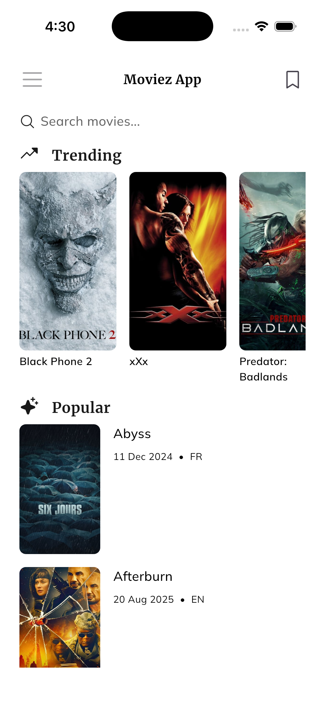
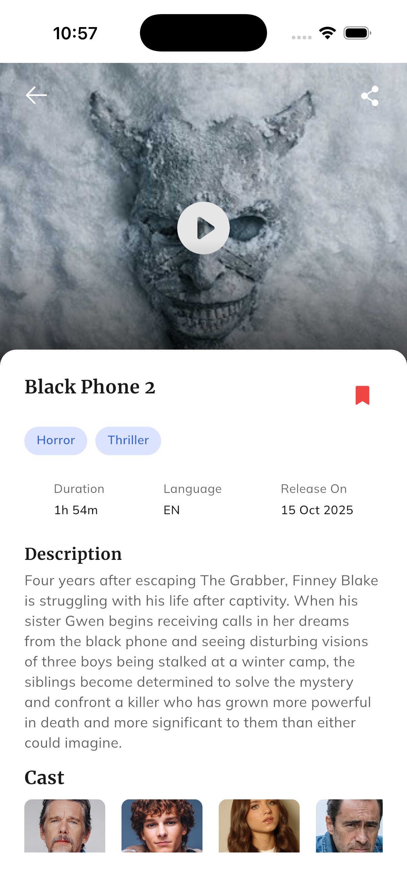
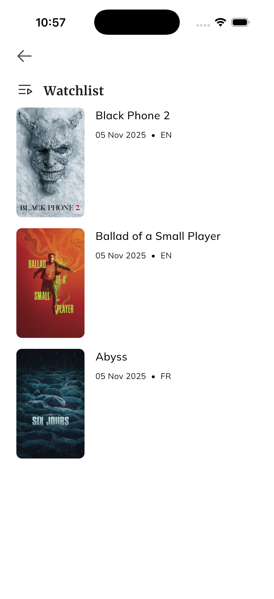

# Moviez — TMDB Movies App

Simple Flutter app using TMDB API to show trending & now playing movies, view details, search, and save bookmarks.

Quick highlights
- Trending & Now Playing (TMDB)
- Movie details with cast and trailer
- Search with debounce-as-you-type
- Bookmark (watchlist) persisted with Hive
- Offline support via cached responses
- Deep-link / share support

Screenshots

Screenshots are in the `screenshots/` folder in the root of the repository (not in assets/images, to avoid increasing APK size):

**Home Page**



**Movie Details**



**Watchlist**



Download APK

[Download latest release APK](https://github.com/TusharSharmaIN/moviez_app/releases)

Quick start
1. Create `.env` with TMDB API key:
```
TMDB_API_KEY=your_tmdb_api_key
```
2. Install deps:
```
flutter pub get
```
3. Run (dev):
```
flutter run -t lib/main_dev.dart
```

Build (release APK):
```
flutter build apk --release --flavor prod -t lib/main_prod.dart
```

Notes
- Run codegen after model changes:
```
flutter pub run build_runner build --delete-conflicting-outputs
```
- If Hive adapter typeIds change, clear app data or uninstall app to reset local DB.

Features
- Home: trending + now playing (cached)
- Details: images, overview, runtime, genres, cast, trailer
- Watchlist: add/remove and view saved movies (local)
- Search: live, debounced queries
- Deep link: open movie via URL (e.g. `moviezapp://movie/123`)

Architecture
- Layered: presentation -> bloc -> domain -> infrastructure
- Repositories + remote/local data sources
- DI with get_it, routing with go_router
